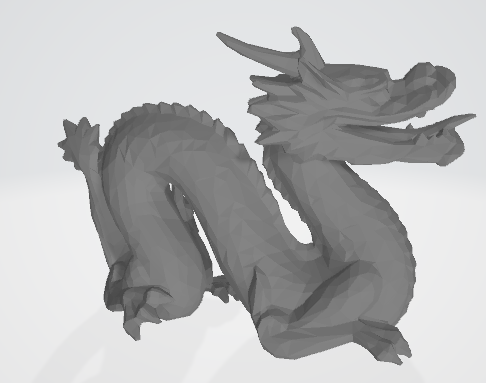
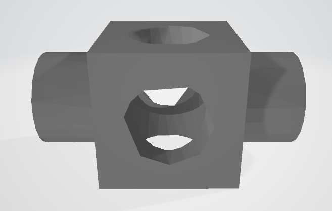
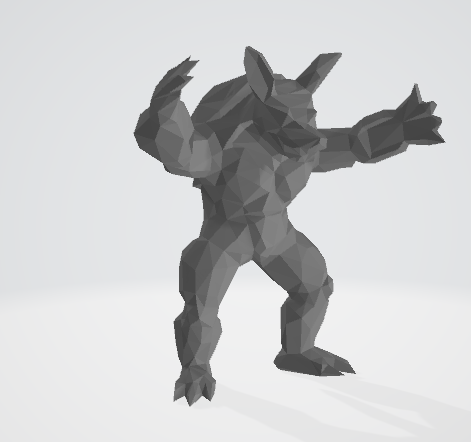

# 基于边塌缩的增量网格简化

石景宜 2016011395

## 一、 设计过程

使用二次误差计算出每个Pair的坍缩代价，维护一个小顶堆，每次选取代价最小的Pair进行合并。

### 主要代码结构

主要代码包含以下类：

+ `MatrixK`：矩阵的存储；通过两个Q矩阵计算最佳点、cost。
+ `Vector3`：搬运自作业二，主要实现了三维向量运算。
+ `Face`：面的存储。
+ `Vertex`：点，其中包含点的位置、相连的点和面。
+ `Pair`：点对，包含每个pair的代价、最佳塌缩位置。
+ `ObjSimplifier`：主要运算类，其主要函数功能如下
  + `readObj`：读取文件。
  + `buildVertexLinks`：建立点和点、点和面的连接。
  + `getQvs`：计算每一个点的$ Q_v $矩阵。
  + `getPairs`：将符合要求的点对存储在`pair`中。
  + `getCostAndBestPos`：计算每个`pair`的代价和最佳塌缩位置。
  + `run`：主要迭代控制。

代码中，小顶堆的实现采用了`algorithm`中的库函数。

由于在迭代过程中没有立即重新计算删除点相关其他`Pair`的cost，而是直到该`pair`被选取时再计算。

## 二、 实验结果

### 坍缩比 0.03








## 三、 运行方式

##### 编译

在`src`目录下执行`make`指令。

##### 运行

````
main.exe <input dir> <output dir> <currency>
````

